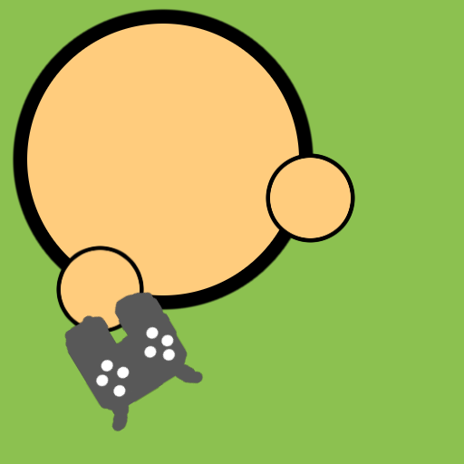

   

# Survev Controller

Add full controller support to **Survev.io**.

Play the browser battle royale using a gamepad instead of keyboard and mouse.

---

# Overview

Survev Controller is a browser extension that adds controller support to the browser game **Survev.io**.  
It allows players to use common gamepads such as Xbox and PlayStation controllers for movement, aiming, shooting, and other actions.

The extension translates controller input into the controls used by the game, allowing Survev to be played comfortably on devices that rely on controllers.

This is especially useful for:
- handheld gaming devices
- couch setups
- accessibility needs
- players who simply prefer controller input

---

# Features

- Full controller support
- Customizable button bindings
- Adjustable controller behaviour
- Toggleable features
- Works directly in the browser
- Lightweight implementation

The extension is designed to integrate with the game without modifying the core gameplay experience.

---

# Installation

## Chrome / Chromium Browsers

1. Download the latest `.crx` release from the **Releases** page.
2. Open `chrome://extensions`
3. Enable **Developer Mode** (top right).
4. Drag and drop the `.crx` file onto the extensions page.
5. Open **Survev.io** and start playing.

---

## Firefox

1. Download the latest `.xpi` release from the **Releases** page.
2. Open `about:addons`
3. Drag and drop the `.xpi` file into the page.
4. Click **Install** when prompted.
5. Open **Survev.io** and enjoy.

---

# Supported Controllers

The extension uses the browser **Gamepad API**, which means many controllers may work automatically.

### Verified Controllers

- Xbox 360 Controller
- Xbox One Controller
- DualShock 4

Other controllers may work, but have not been officially tested.

---

# Customisation

Survev Controller allows players to configure how their controller behaves.

Available customization options include:

- Button mapping
- Feature toggles
- Controller behaviour adjustments
- Input configuration

Players can enable or disable features depending on their preferences.

---

# FAQ

### What is Survev Controller Support?

Survev Controller Support is a browser extension that enables controller gameplay in **Survev.io**.

---

### Does this give any unfair advantage?

No.  
The extension does not modify the game or provide gameplay advantages. It simply translates controller input into normal game controls.

---

### What controllers are supported?

Any controller compatible with the browser Gamepad API may work, although only a few have been tested.

---

### Can I still use keyboard and mouse?

Yes. Controller support does not prevent keyboard and mouse input.

---

### Why isn't my controller detected?

Make sure that:

- The controller is connected before opening the game
- Your browser supports the Gamepad API
- The controller is properly detected by your operating system

Refreshing the page can also help.

---

# Troubleshooting

### Controller not responding

Try the following:

- reconnect the controller
- refresh the page
- check that the browser recognizes the controller
- ensure no other software is blocking input

---

### High CPU usage

Controller polling may slightly increase CPU usage depending on browser behaviour.  
Closing unused tabs or refreshing the page can sometimes improve performance.

---

# Technical Details

The extension works by using the browser's **Gamepad API** to read controller input.

Controller inputs are then converted into the equivalent actions used by Survev, such as:

- movement
- shooting
- weapon switching
- interaction

This process runs continuously while the game is open to ensure responsive controls.

---

# Contributing

Bug reports, feature suggestions, and pull requests are welcome.

If you find a problem or have an idea for improvement, feel free to open an issue on the repository.

---

# Credits

**catsarews5319**  
Idea for the project

**piesimp**  
Creator of Survev Controller

**HoaiBao0906**  
Testing, bug reports, and feature ideas :trollface:
